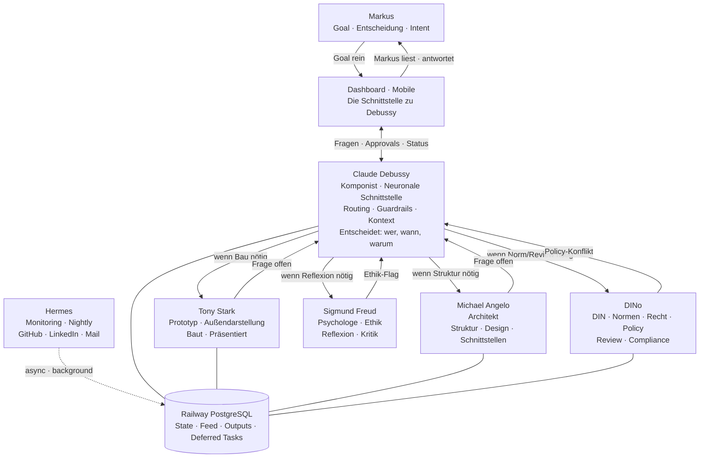

# Architektur-Snapshot: Debussy-Vision
Datum: 2026-04-03
Status: Ziel-Architektur — noch nicht vollständig implementiert

## Mermaid

## Was sich gegenüber v1 geändert hat

- George war Coordinator-Persona → ersetzt durch Claude Debussy
- George bleibt der Name des *Systems*, nicht einer Rolle darin
- Debussy ist nicht eine Rolle im Run — Debussy *ist* der Run
- Dashboard = Schnittstelle Markus↔Debussy, nicht nur Visualisierung
- Sigmund Freud neu: Ethik, Psychologie, Reflexion, Kritik
- Tony Stark erweitert: nicht nur Implementer, auch Außendarstellung
- DINo geschärft: DIN/Normen/Recht/Policy, nicht nur "Reviewer"
- deferred_tasks: Aufgaben können für später gespeichert werden

## Noch nicht implementiert
- Debussy als benannte Coordinator-Rolle im Code
- Sigmund Freud in Registry + Bootstrap
- deferred_tasks Tabelle
- Frage-Routing Tony→Debussy→Markus via Dashboard
- Mermaid-History Tabelle in PostgreSQL
